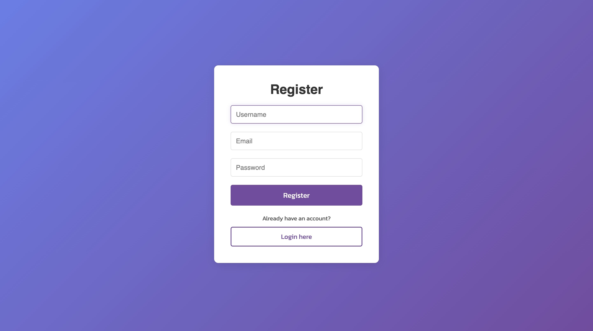
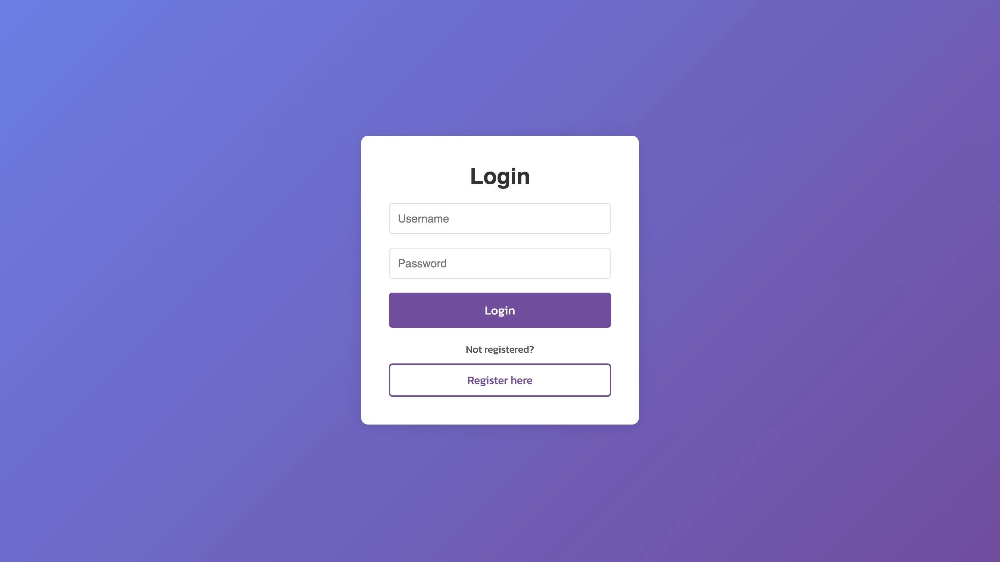
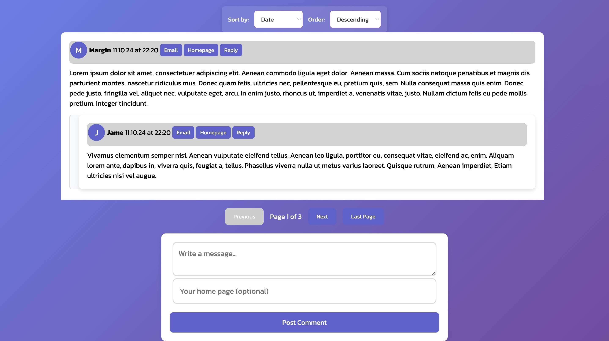

# SPA-service
### Description
SPA-Service is a full-stack single-page application (SPA) designed to provide a smooth, real-time user experience by leveraging modern web technologies.
This project demonstrates the integration of a modern SPA frontend with a powerful Django backend, utilizing real-time capabilities and cloud infrastructure to deliver a production-ready solution.

- **Django**: backend framework, offering a robust and scalable architecture for server-side logic.
- **Django REST Framework**: to create a flexible and powerful API.
- **Vue.js**: for a reactive and dynamic front-end experience, ensuring a smooth and responsive user interface.
- **JWT authentication**: for secure and efficient user login functionality.
- **WebSockets**: from Django Channels to enable real-time, bidirectional communication, powering features such as live updates without the need for page reloads.
- **PostgreSQL**: as the primary database for storing application data.
- **Redis**: for channel layer binding in WebSockets, ensuring efficient real-time message distribution.
- **Docker**: for containerized , ensuring easy scalability and consistent development environments.
- **Deploy**: AWS hosts the application for cloud-based deployment, while Nginx serves as the reverse proxy to efficiently handle static files and requests.

1. **Clone the repository**:
    ```bash
    git clone https://github.com/Unlie9/SPA-service.git
    cd spa_service
    ```
2. **Create a virtual environment**:
    ```bash
    python -m venv env
    source env/bin/activate
    ```
3. **Install dependencies**:
    ```bash
    cd backend
    pip install -r requirements.txt
    ```
    > **Note**: Dont forget for your .env files
4. **Run with Docker**:
    ```bash
    cd spa_serivce
    docker-compose up --build
    ```

## Endpoints

- **Admin**: - `/admin/`
- **Register**: - `/register/`
- **Login**: - `/login/`
- **Comments Page**: - `/comments/`

## Db schema


## Demo



