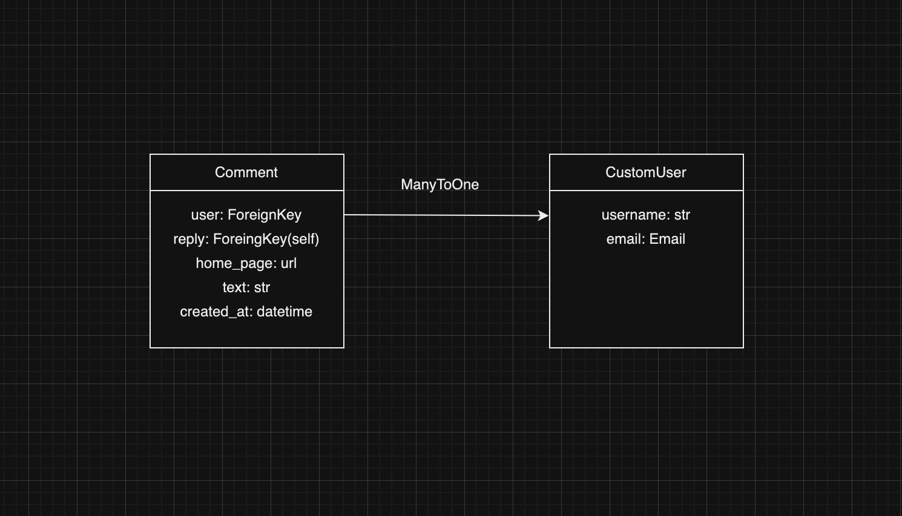

# SPA-service
### Description
##### SPA-Service is a full-stack single-page application (SPA) designed to provide a smooth, real-time user experience by leveraging modern web technologies. The project seamlessly integrates the following technologies:

##### Django as the backend framework, offering a robust and scalable architecture for server-side logic.

##### Django REST Framework to create a flexible and powerful API.

##### Vue.js for a reactive and dynamic front-end experience, ensuring a smooth and responsive user interface.

##### JWT authentication for secure and efficient user login functionality.

##### Django Channels with WebSockets to enable real-time, bidirectional communication, powering features such as live updates without the need for page reloads.

##### PostgreSQL as the primary database for storing application data.

##### Redis for channel layer binding in WebSockets, ensuring efficient real-time message distribution.

##### The project is containerized using Docker, ensuring easy scalability and consistent development environments.

##### AWS hosts the application for cloud-based deployment, while Nginx serves as the reverse proxy to efficiently handle static files and requests.

##### This project demonstrates the integration of a modern SPA frontend with a powerful Django backend, utilizing real-time capabilities and cloud infrastructure to deliver a production-ready solution.

